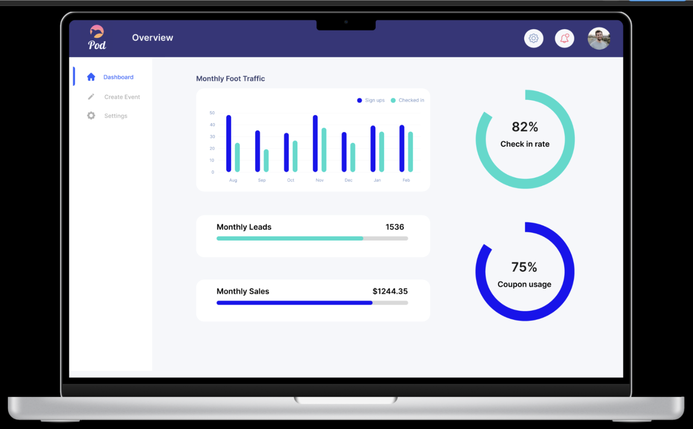
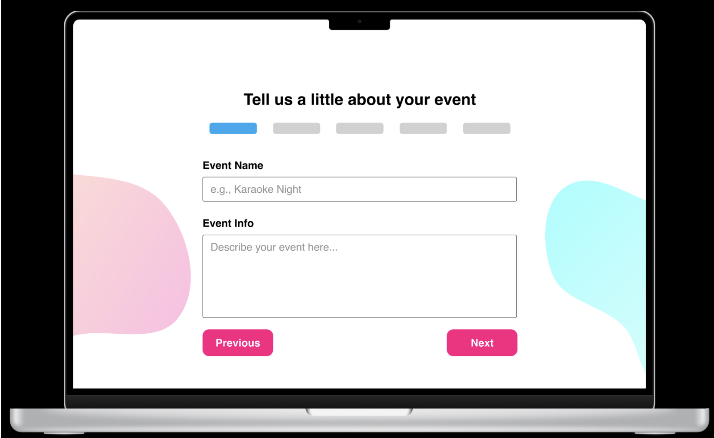
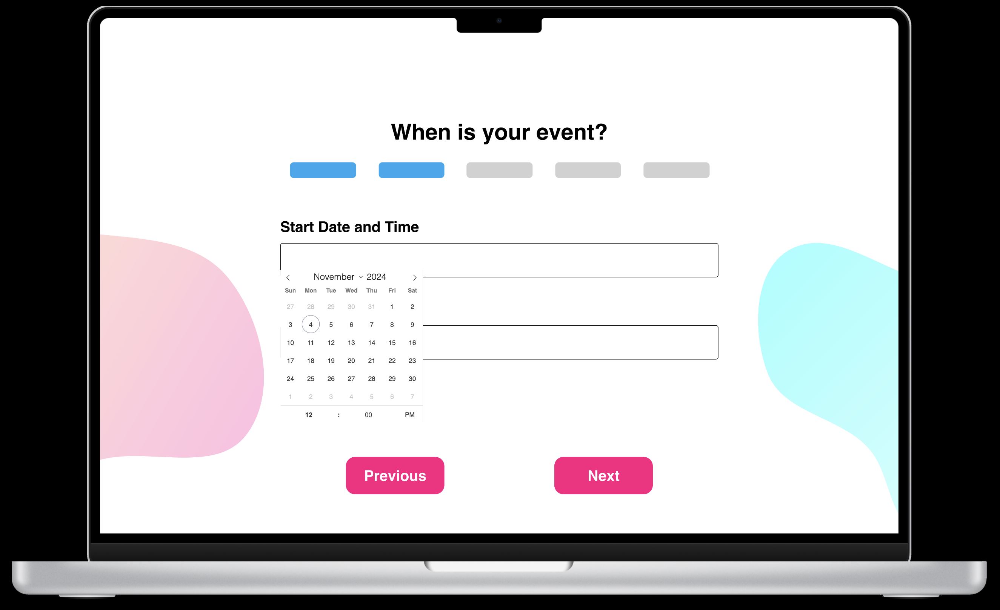
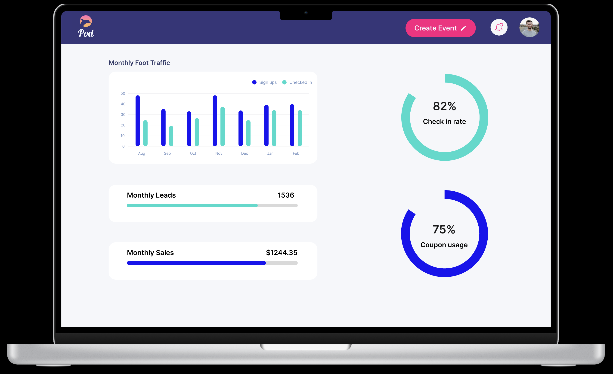
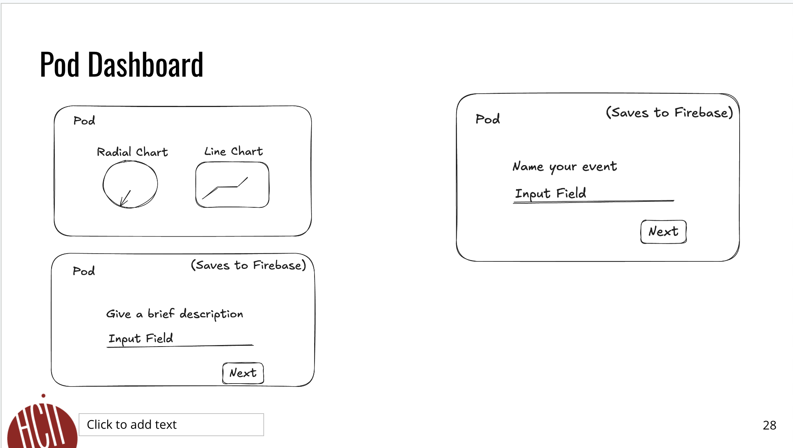
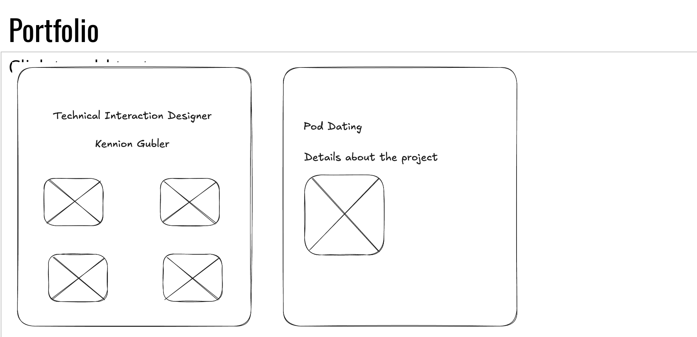
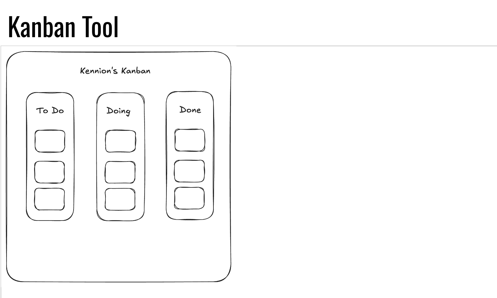

FP4 - Final Project Writeup
Feel free to refer to this Markdown Cheat Sheet to make your writeup more organized, and you can preview your markdown file in VSCode Markdown editing with Visual Studio Code.

## Part 2: User Interaction

How a user would interact with your website? For each step, briefly but clearly state the interaction type & how we should reproduce it.

1. Interaction type. Click on X on page Y / scroll on page X, etc.  
2. 

## Part 3: External Tool

Describe what important external tool you used (JavaScript library, Web API, animations, or other). Following the bulleted list format below, reply to each of the prompts.

1. Name of tool1  
   * Why did you choose to use it over other alternatives? (2 sentences max)  
   * How you used it? (2 sentences max)  
   * What does it add to your website? (2 sentences max)  
2. Name of tool2

## Part 4: Design Iteration

Describe how you iterated on your prototypes, if at all, including any changes you made to your original design while you were implementing your website and the rationale for the changes. (4-8 sentences max)

## Part 5: Implementation Challenge

What challenges did you experience in implementing your website? (2-4 sentences max)

## Part 6: Generative AI Use and Reflection

Describe how you used Generative AI tools to create this final project (fill in the following information, write \~500 words in total).

Document your use of all GenAI tools — ChatGPT, Copilot, Claude, Cursor, etc. using the template below. Add/Delete rows or bullet points if needed, and replace Tool1/Tool2 with the name of the tool.

### Usage Experiences by Project Aspects

Feel free to edit the column \_ (other?) or add more columns if there's any other aspect in your project you've used the GenAI tools for.

For the following aspects of your project, edit the corresponding table cell to answer:
- *Usage*: Whether you used / did not use this tool for the aspect. Enter [Yes/No]
- *Productivity*: Give a rating on whether this tool makes your productivity for X aspect [1-Much Reduced, 2-Reduced, 3-Slightly Reduced, 4-Not Reduced nor Improved, 5-Slightly Improved, 6-Improved, 7-Much Improved].

| Tool Name | Ratings | design | plan | write code | debug | \_ (other?) |
| :---- | :---- | :---- | :---- | :---- | :---- | :---- |
| Tool1 | Usage | Yes/No | Yes/No | Yes/No | Yes/No | Yes/No |
| Tool1 | Productivity | 1~7 | 1~7 | 1~7 | 1~7 | 1~7 |
| Tool2| Usage | Yes/No | Yes/No | Yes/No | Yes/No | Yes/No |
| Tool2 | Productivity | 1~7 | 1~7 | 1~7 | 1~7 | 1~7 |

### Usage Reflection

> Impact on your design and plan 
* It matched my expectations and plan in [FP2](#generative-ai-use-plan) in that … For example, 
  1. Tool1: 
  2. Tool2:
* It did not match my expectations and plan in [FP2](#generative-ai-use-plan) in that … For example, 
  1. Tool1: 
  2. Tool2:
* GenAI tool did/did not influence my final design and implementation plan because … For example, 
  1. Tool1: 
  2. Tool2:

> Use patterns
* I accepted the generations when …  For example, 
  1. Tool1: this tool once suggested … and I adjusted my design according to the suggestion because … 
  2. Tool2: 
* I critiqued/evaluated the generated suggestions by … For example, 
  1. Tool1: this tool once suggested … but I modified/rejected the suggestion because … 
  2. Tool2: 

> Pros and cons of using GenAI tools
* Pros
  1. Tool1: 
  2. Tool2:
* Cons
  1. Tool1: 
  2. Tool2:

### Usage Log

Document the usage logs (prompts and chat history links) for the GenAI tools you used. Some tools may not have an easy way to share usage logs, just try your best! Some instructions for different tools:

1. [ChatGPT](https://help.openai.com/en/articles/7925741-chatgpt-shared-links-faq) / [Gemini](https://support.google.com/gemini/answer/13743730?hl=en&co=GENIE.Platform%3DDesktop): share the anonymous link to all of your chat histories relevant to this project
2. [GitHub Copilot (VSCode)](https://code.visualstudio.com/docs/copilot/copilot-chat#:~:text=You%20can%20export%20all%20prompts%20and%20responses%20for%20a%20chat%20session%20in%20a%20JSON%20file%20with%20the%20Chat%3A%20Export%20Session...%20command%20(workbench.action.chat.export)%20in%20the%20Command%20Palette.): export chat histories relevant to this project.

---

# **FP3 \- Final Project Check-in**

Document the changes and progress of your project. How have you followed or changed your implementation & GenAI use plan and why? Remember to commit your code to save your progress.

## Implementation Plan Updates

- [ ] ...

## Generative AI Use Plan Updates

- [ ] ...

Remember to keep track of your prompts and usage for [FP4 writeup](#part-6-generative-ai-use-and-reflection).

---

# **FP2 \- Evaluation of the Final project**

## Project Description

Pod Dating is a way to find people in person first. You go to an event, meet people there, like and pass on people that you met in person. It's that simple. Gone are the days of meeting online strangers that may or may not exist. Join the Pod. 

## High-Fi Prototypes

### *Prototype 1*

Some of the main things I found in the feedback was the navigation (going from event creation to the dashboard), microinteractions, and the date picker. 

### *Prototype 2*

## Usability Test

I conducted some usability tests and also asked a small business owner about what they saw in the dashboard and suggestions on how it might be improved. The usability test was conducted with my Figma prototype and I asked a few questions to understand their business (a mini golf place) and how I could be of service to them. 

In the usability test, I found a similar problem set that was also noted in our presentations. The first thing that I found is that people generally thought that the dashboard should lead to a new page and should be a separate page. Next, I found that the current date picker was lacking, so I am planning on using a new one (though the one that I am using now is still not necessarily final). It will need to select both date and time, so I am going to work to find one that can do that well or consider two separate input fields as other websites often do. I also found with one of my interviewees that it may be useful to be able to integrate with other event management systems that they may already use which is something I’ll consider (this would be a future goal).

I incorporated this feedback into my design by ensuring the dashboard had a big button that allowed users to create an event and got rid of the side panel that was unnecessary for this project right now. 

## Updated Designs

In these screenshots, I focused on ensuring that the flow from the dashboard to the event creation was as seamless as possible while also addressing concerns about the date picker. In my full coded version, I'll focus more on micro-interactions and other such delightful experiences. 

## Feedback Summary
  The in-class feedback largely consisted of some general feedback such as getting rid of the side panel and adding microinteractions both of which I think are good. For the micro-interactions, I think just some hover effects and animated charts would be good. I do not want the dashboard to become burdened with animations that do not convey anything. I like some of the ideas around the comparison between using Pod and not using Pod, but I would worry that this could become complicated with my backend and not provide as much value. It would also be tough to distinguish between Pod tickets and non Pod tickets for example as I would not necessarily have access to this data. For those reasons, I will not pursue that. Currently, I will focus on micro-interactions, clear navigation, and clean backend logic to ensure data integrity and validity. 
  As for the tooltips, I think those could be helpful, but I’d want to ensure that they were not your average, ugly tooltips that plague so many interfaces today. I would also only use them on relevant visualizations that have a clear need to be explained (I generally try to avoid anything that can be construed as a “pop-up”). 
  I am also strongly considering different charts as well, but it is slightly constrained by the data I’ll have available as this is meant to actually be used! 

## Milestones

### *Implementation Plan*

- [ ] Week 9 Oct 28 \- Nov 1:
  - [X] FP1 due
  - [X] Conduct usability testing to find out which design will work best
  
- [ ] Week 10 Nov 4 \- Nov 8:   
  - [X] FP2 due
  - [ ] Set to work on creating the skeleton of this website 
  - [X] Finalize designs that I will be working on
  - 

- [ ] Week 11 Nov 11 \- Nov 15:  
  - [ ] Create the create event flow and link it to firebase
  - [ ] Ensure that events are able to show up on the Pod Dating app
  - [ ] Debug Pod Dating App as necessary 
- [ ] Week 12 Nov 18 \- Nov 22:
  - [ ] Finish creating the event creation flow and ensure that poster creation is handled correctly (Poster creation will generate a QR code into a poster so that business owners can hang up the poster and users can check in to the event)   
- [ ] Week 13 Nov 25 \- Nov 29:  
  - [ ] Work on the dashboard creating data visualizations from backend data. 
  - [ ] Ensure that there is a seamless experience between dashboard and event creation 

  - [ ] Thanksgiving  
- [ ] Week 14 Dec 2 \- Dec 6:  
  - [ ] Add microinteractions that make the experience feel engaging such as bouncy buttons (ripple effect), tooltips (as necessary), and animated charts to ensure they feel professional.
  - [ ] FP4 due 

### *Libraries and Other Components*
https://flatpickr.js.org/examples/ (This will be used for the date picker)
I'll use react for this project.
I'm sure there are many libraries that I'll use as necessary. 
* 

## Generative AI Use Plan

I'll use AI for this project to take away some of the need for the "intellectual manual labor." For example, I'll focus on using it for genersting code to fit the visual standards I set for myself. I'll also use it to help me brainstorm ideas of how to do certain things such as connecting the database for example. I like using AI to understand the problem deeper and focus on understanding the general concepts to a deeper degree. I'll balance this, of course, with the requirement to be able to explain each line of code.  

### *Tool Use*

 What would you use? Edit the list given your plan. For each tool, explain briefly on what do you expect Generative AI to help you with and what might it not be able to help you with.

* ChatGPT  
  * I will use it for code generation for components and "boilerplate" code because it can help me save time focusing on the usability component of this project.
  * I will not use it for generating massive amounts of code because it will not help me understand when things go wrong. 
  * I will be careful using it for logic generation as it can be wrong and can be easy to not understand exactly what the code is doing. 
* GitHub Copilot  
* I will use Github Copilot for similar use cases to ChatGPT as needed 

### *Responsible Use*

I want to ensure that I use AI to allow myself to focus more on the usability and overall experience of my website. I want to ensure, however, that I do not become so reliant on my use of AI that it becomes difficult to understand what code is doing which can certainly be a temptation. 

---

## Visuals

---

# Part 1: Website Description

**Pod for Business** focuses on delivering value to event-hosting businesses by offering tools to help anticipate attendance. This planning capability empowers businesses to prepare adequately, ensuring they have the necessary resources (like food, drinks, and seating) to provide each attendee with a cohesive, special experience.

**Pod for Business** is designed to support businesses in managing events effectively, focusing on delivering relevant insights while respecting user privacy. No specific user data, such as gender or individual matches, will be shown. Instead, the system highlights key metrics, such as the number of attendees who scanned a QR code, giving businesses a clear view of the event’s impact and the value Pod provides. Additionally, it will display attendance trends across different weeks and months, helping businesses evaluate event success and public perception more accurately. This can help businesses plan discounts, special deals, etc., on days that might generally be less busy.

This platform aims to create significant value for event-hosting businesses by also offering planning tools to help anticipate attendance. With these tools, businesses can better prepare for upcoming events, ensuring they have the necessary resources to accommodate expected attendees, such as food, drinks, seating, etc., to ensure a cohesive and special experience for each person, leading to better ratings.

The flow prioritizes a simple event creation process first. This emphasis on ease of setup ensures that businesses can create events quickly and efficiently, allowing them to focus on what matters most without losing valuable time.

This problem is important to me, as I want to help small businesses engage with the community and help them stand out from other businesses. I also think it’s time to phase out the current trend of online dating, which is manipulative and leads to seeing people as transactional rather than special.

---

## Feedback Summary

The main feedback I received for Pod for Business is on the **data privacy** side, which I think is essential to address clearly. I will not have data visualizations based on any specific user data. Instead, the focus will be on how many people show up and scan the Pod QR code. Other data points mentioned included needing to consider how the data will be visualized. I plan to keep it relatively simple at first, perhaps using a line chart showing the number of people at an event on a given day. This will enable businesses to make informed decisions, like planning discounts on less busy days.

Feedback on my portfolio centered on **interaction considerations**. Many noted that excessive interactions could distract from the showcased work, so I’ll likely keep this project straightforward, as my portfolio design is simple and should remain that way.

Regarding the **Kanban board**, some feedback suggested it felt dull and could be differentiated more. I aim to incorporate data labeling and possibly drag-and-drop features, potentially adding these elements to the Pod dashboard.

---

## Feedback Digestion

The main critique that I plan to act on is the focus on data privacy and clear communication regarding any data collected. Since the app is not focused on collecting personal data, its revenue model would rely on business partnerships and premium subscriptions rather than ads. 

I will focus on the Pod for Business idea as it is the most relevant project for my portfolio. I have already developed a project that could include a business dashboard, which would lead to a cohesive design solution that leverages desktop design, tablet and mobile designs, and various web and mobile app technologies. It is also something I expect to continue working on in the future, increasing my motivation to go above and beyond.

Balancing the scope to meet requirements without expanding too much is essential in creating this web app, especially given other coursework. I want to provide significant value to the end user while maintaining project feasibility.

Taking the feedback seriously regarding **clarity** on what Pod for Business aims to achieve is critical. For business pitches, the value proposition and prototypes must be clearly outlined to showcase how Pod for Business helps local businesses compete with larger entities with more resources for engagement.

---
